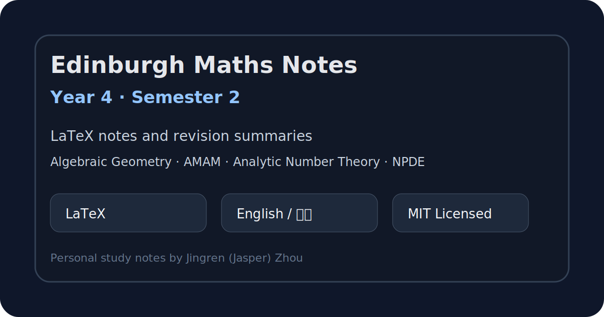

# Edinburgh Maths Year 4 Notes – Semester 2



A cleaned public collection of my personal **LaTeX notes and revision summaries** for **Year 4 Mathematics, Semester 2** at the **University of Edinburgh**.

This README follows the repository's actual visible folder structure. The current repository contains notes for Algebraic Geometry, Advanced Methods of Applied Mathematics, Analytic Number Theory, and NPDE-related material.

## Courses included

| Course | Folder | Notes |
|---|---:|---|
| Advanced Methods of Applied Mathematics | `AMAM/Note/` | Applied mathematics methods, examples, and revision summaries |
| Analytic Number Theory | `ANT/Note/` | Number-theoretic definitions, results, examples, and proof-oriented notes |
| Numerical / Nonlinear PDE material | `NPDE/Note/` | PDE-related LaTeX notes and supporting style files |

## Repository structure

```text
.
├── AMAM/Note/      # Advanced Methods of Applied Mathematics notes
├── ANT/Note/       # Analytic Number Theory notes
├── NPDE/Note/      # PDE-related notes
├── assets/         # README images and preview assets
├── .gitignore      # LaTeX/editor build artefact exclusions
├── LICENSE         # MIT License
└── README.md
```

## Features

- Written in **LaTeX**
- Bilingual notes: **English and Chinese** where helpful
- Focuses on definitions, theorem statements, methods, examples, and revision summaries
- Cleaned for public release: generated LaTeX logs, `.aux` files, and local editor artefacts are excluded

## How to use

Read the compiled PDFs if present, or compile the `.tex` files yourself with XeLaTeX.

```bash
xelatex "Note File.tex"
```

For documents using references, tables of contents, or cross-references, run XeLaTeX more than once.

## Disclaimer

These are personal study notes and may contain mistakes, omissions, or non-standard explanations. They are **not official University of Edinburgh course materials**. Please use them as supplementary revision material only.

## License

Released under the [MIT License](LICENSE). You may use, adapt, and share the notes, but please keep the copyright and license notice.
